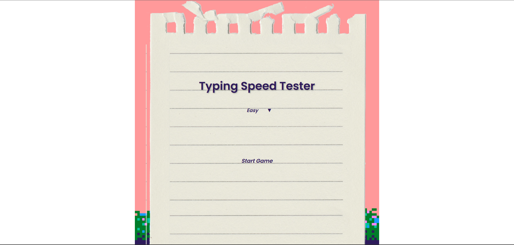

# Typing Speed Tester

  

---

## Game Overview

**Typing Speed Tester** is a fun and interactive browser-based game designed to measure your typing speed and accuracy. Users are given randomly generated sentences to type within three difficulty levels: Easy, Medium, and Hard. As you type, the timer tracks your speed, and at the end of the round, your accuracy is calculated.

I made this game to help me improve my typing since I’m a slow typer. Building this game was also a great way to practice working with JavaScript, handling user input, and managing different screens in a web app.

---

## Getting Started

### Play the Game:
[Click here to play the game](https://ga35a.github.io/Typing-Speed-Tester-game/)  

###  How to Play:
1. Choose a difficulty level from the dropdown.
2. Click the **Start Game** button.
3. Begin typing the sentence that appears on screen.
4. Your time and accuracy will be shown once you finish typing.

###  Planning Materials:

---

## Attributions

- **Font**: [Google Fonts](https://fonts.googleapis.com/css2?family=Poppins:wght@300;400;600&display=swap)

## Technologies Used

- HTML
- CSS
- JavaScript
---

## Next Steps

Here are some planned enhancements for future versions:

-  Add WPM (Words Per Minute) calculator.
-  Store and display high scores or leaderboard.
-  Include sound effects for correct/incorrect letters.
-  Make the game mobile-responsive.
-  Let users input custom practice sentences.

---

Thanks for checking out my project! 🎉 Feel free to share your feedback or suggestions.
